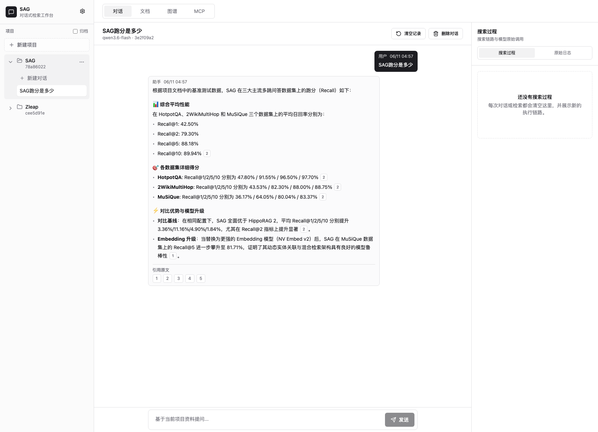
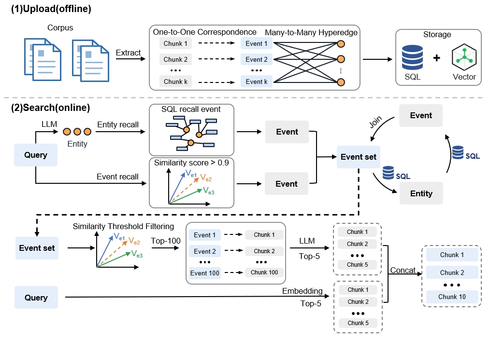
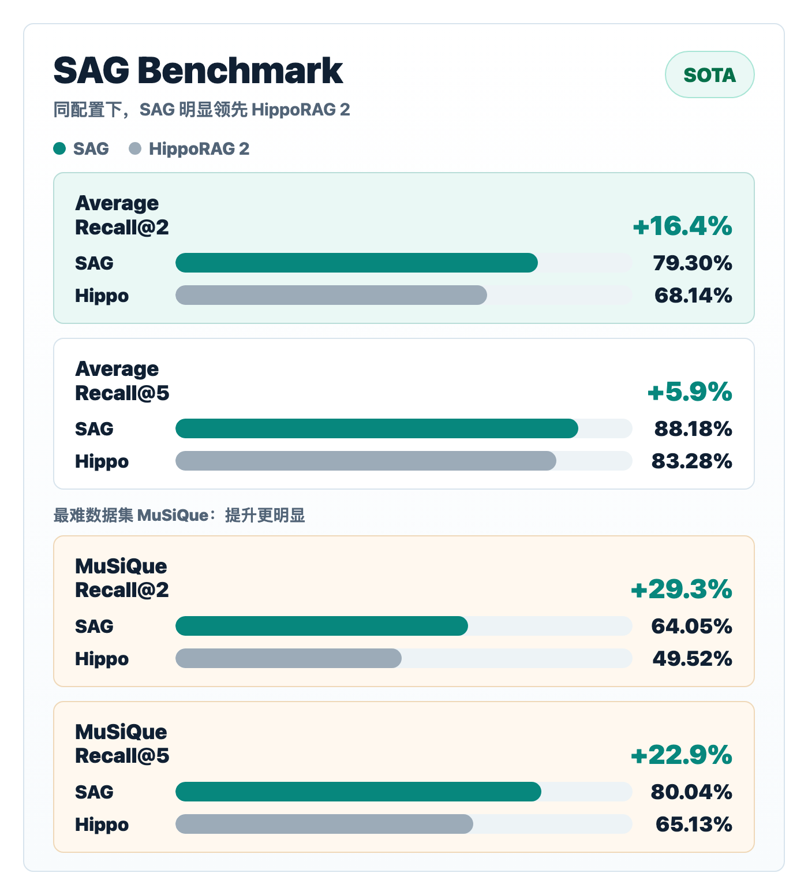
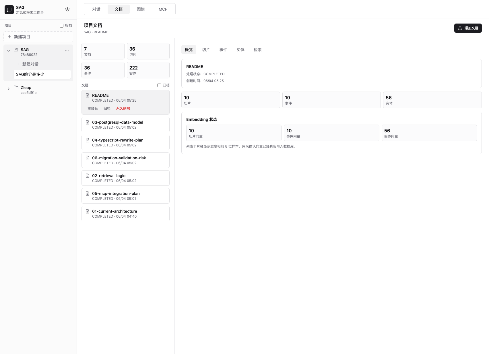
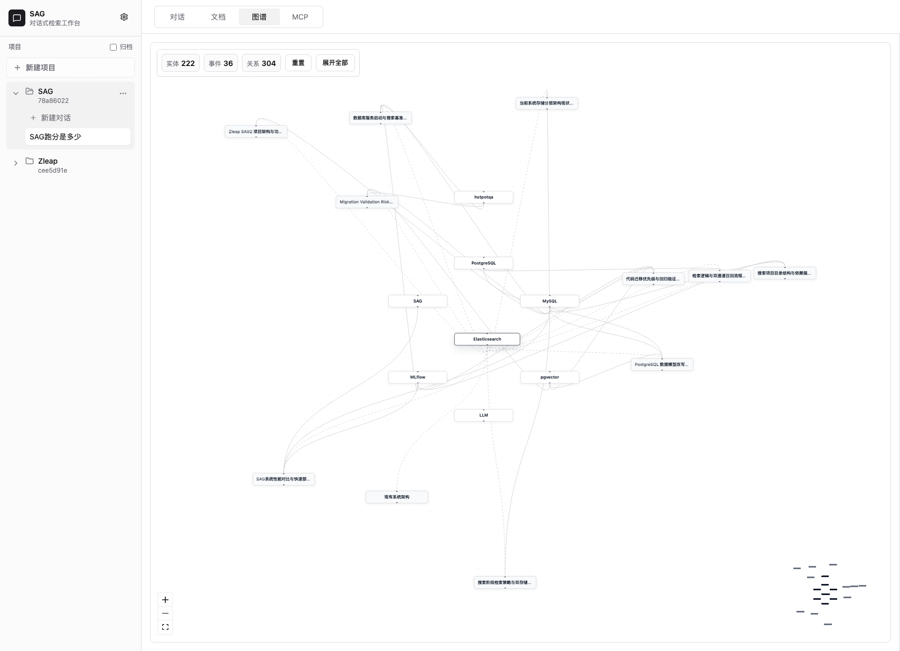

<p align="center">
  
</p>

# SAG

**语言**：简体中文 | [English](README.md)

> **SAG:** 可以在大规模动态数据上运行的图谱检索技术
> 
> **Paper:** [https://arxiv.org/abs/2606.15971](https://arxiv.org/abs/2606.15971)

本项目是基于 SAG 制作的开箱即用的文档检索工作台：上传 Markdown / TXT 文档后，系统会自动完成切片、向量化、事项提取、实体提取和关系整理。你可以像使用 ChatGPT 一样围绕项目资料连续提问，也可以查看每个文档的切片、事项、实体、Embedding、搜索过程、原始模型日志和知识图谱。



## RAG 领域新 SOTA

论文复现代码：[Zleap-AI/SAG-Benchmark](https://github.com/Zleap-AI/SAG-Benchmark)

SAG 是面向 Agent 的新一代 RAG 技术路线。它不靠给模型塞更多 chunk，而是用更轻量的结构重新组织文档知识：

```text
chunk -> event
chunk -> entities
event <-> entities
```

每个 chunk 提取一个完整事项 event 和多个 entities。event 保留完整语义，entities 负责索引和关系扩展，让检索可以从命中事项出发继续多跳召回，同时避免重型知识图谱的全局重建成本。



在 HotpotQA / 2WikiMultiHop / MuSiQue 上，使用相同配置：

```text
Embedding = bge-large-en-v1.5
LLM = qwen3.6-flash
Datasets = HotpotQA / 2WikiMultiHop / MuSiQue
```

SAG 对比 HippoRAG 2 在多跳问答召回上取得了明显提升：**平均 Recall@2 从 68.14% 提升到 79.30%，提升 11.16 个百分点，相对提升约 16.4%**。Recall@2 更高意味着 Agent 可以用更少上下文更早命中关键证据，减少 token 成本、延迟和多轮任务里的干扰。



在 MuSiQue Recall@5 上，SAG 从 HippoRAG 2 的 65.13% 提升到 80.04%；换用 NV-Embed-v2 后进一步达到 81.71%，说明收益主要来自结构设计，而不只是更强的 embedding 模型。

## SAG 能做什么

这个项目把 SAG 技术做成了一个可以直接运行的本地工作台，适合：

- 项目文档问答
- 个人知识库检索
- RAG / Agent 原型验证
- 文档事项和实体分析
- MCP 工具接入测试
- 检索链路调试和模型调用观察

核心功能：

- **项目管理**：每个项目拥有自己的文档、对话、图谱和 MCP 配置。
- **多文档上传**：支持一次上传多个 Markdown / TXT 文档，展示处理阶段和进度。
- **文档处理结果**：查看切片、事项、实体、Embedding 数据，支持标题关键字搜索和分页浏览。
- **对话式检索**：围绕当前项目资料多轮提问，支持流式输出和停止生成。
- **引用原文**：回答里可以显示引用序号，点击查看对应原文块。
- **搜索过程可视化**：右侧面板实时展示 SAG 内部检索链路和耗时。
- **原始日志**：浏览器缓存中可查看 LLM / Embedding / Rerank 原始请求和返回。
- **知识图谱**：以实体和事项为节点查看项目关系，可拖动、缩放、展开和查看详情。
- **MCP 接入**：每个项目都有自己的 MCP 配置，外部 Agent 可直接调用当前项目资料。

## 技术栈

SAG 使用 TypeScript 贯穿前后端。前端是 React + Vite + Tailwind CSS 的 WebUI；后端是 Fastify HTTP API、MCP TypeScript SDK 和分层服务模块；数据层使用 PostgreSQL、pgvector、全文检索和 SQL 多跳查询；模型侧兼容 OpenAI-compatible 的 LLM、Embedding 和 Rerank 接口。

## 工作台预览

### 文档处理

在「文档」页可以上传文档，查看处理状态、切片、事项、实体和 Embedding。



### 图谱浏览

在「图谱」页可以查看项目内实体和事项关系。节点可以拖动、缩放，点击展开，双击打开详情。



### 对话检索

在「对话」页可以围绕当前项目资料连续提问。每次检索都会刷新右侧搜索过程，方便调试本轮调用链路。

## 检索模式

SAG 提供两种模式：

- **极速模式**：直接用 query 在实体库做全文 / BM25 匹配，结合 SAG 多跳扩展，最后用 `qwen3-rerank` 选择 top-k。这个模式不需要 LLM 抽 query 实体，也不需要 LLM 过滤候选，速度更快。
- **标准模式**：用 LLM 抽取 query 实体，再走 SAG 多路召回和 LLM 精排，适合对比更高精度链路。

两种模式都不是普通向量搜索，因为它们都使用 SAG 的 event/entity 索引和 SQL 多跳扩展。

## 快速开始

### 1. 准备环境

你需要：

- Node.js 20 或更高版本
- npm
- PostgreSQL
- pgvector

如果你只是想最快跑起来，推荐用 Docker 启动 PostgreSQL。

### 2. 克隆项目

```bash
git clone https://github.com/Zleap-AI/SAG.git
cd SAG
```

### 3. 创建配置文件

```bash
cp .env.example .env
```

`.env.example` 已经包含默认配置。真实使用时，请填入自己的 LLM 和 Embedding API Key。

### 4. 启动 PostgreSQL

使用 Docker：

```bash
docker compose up -d
```

不想用 Docker，也可以在 macOS 上用 Homebrew：

```bash
brew install postgresql@17 pgvector
brew services start postgresql@17

/opt/homebrew/opt/postgresql@17/bin/createdb sag_lite
/opt/homebrew/opt/postgresql@17/bin/psql -d sag_lite -c 'create extension if not exists vector;'
```

如果你使用本机 PostgreSQL，请把 `.env` 里的 `DATABASE_URL` 改成自己的连接地址，例如：

```env
DATABASE_URL=postgres://你的用户名@localhost:5432/sag_lite
```

### 5. 安装依赖并初始化数据库

```bash
npm install
npm run db:setup
```

### 6. 启动开发服务

```bash
npm run dev
```

开发模式默认地址：

```text
WebUI: http://localhost:5173
API:   http://localhost:4173
```

### 7. 构建并启动生产服务

```bash
npm run build
npm start
```

生产模式默认地址：

```text
http://localhost:4173
```

## 第一次怎么用

1. 打开 WebUI。
2. 在左侧项目列表顶部点击「新建项目」。
3. 进入「文档」页，点击「添加文档」。
4. 上传 `.md` 或 `.txt` 文件。
5. 等待处理队列完成。
6. 查看切片、事项、实体和 Embedding 状态。
7. 回到「对话」页，围绕当前项目资料提问。
8. 需要调试时，查看右侧「搜索过程」和「原始日志」。
9. 需要看关系时，进入「图谱」页。
10. 需要给外部 Agent 使用时，进入「MCP」页复制当前项目的配置。

## 配置 LLM 和 Embedding

SAG 支持 OpenAI-compatible 接口。默认示例：

```env
EMBEDDING_BASE_URL=https://api.302ai.cn/v1
EMBEDDING_MODEL=text-embedding-3-large
EMBEDDING_DIMENSIONS=1024

LLM_BASE_URL=https://api.302ai.cn/v1
LLM_MODEL=qwen3.6-flash

RERANK_MODEL=qwen3-rerank
DEFAULT_SEARCH_MODE=fast
```

你可以通过两种方式配置：

### 方式一：WebUI 全局设置

点击左侧顶部的设置图标，进入全局设置页，填写 provider、模型名和 API Key。

API Key 只会显示“已配置 / 未配置”，不会在界面和接口响应里明文回显。

### 方式二：`.env`

```env
EMBEDDING_API_KEY=你的_embedding_key
LLM_API_KEY=你的_llm_key
```

如果没有配置 API Key，系统会使用本地 deterministic fallback，方便跑测试和看界面；真实检索效果请配置远程模型。

## MCP 接入

SAG 可以作为 MCP Server 提供给外部 Agent 使用。每个项目的 MCP 都会绑定当前项目 ID，工具调用时不需要再传 `projectId`。

在 WebUI 里进入「MCP」页，可以看到当前项目自动生成的 `mcpServers` JSON。格式类似：

```json
{
  "mcpServers": {
    "sag": {
      "command": "npm",
      "args": ["run", "mcp"],
      "env": {
        "SAG_MCP_SOURCE_ID": "当前项目ID"
      }
    }
  }
}
```

当前提供的 MCP 工具：

- `sag_ingest_document`：导入文档并执行切片、事项抽取、实体抽取和向量化。
- `sag_search`：对当前项目执行 SAG 多路检索，并返回内部检索 trace。
- `sag_explain_search`：返回当前项目的检索链路说明和 trace。
- `sag_get_event`：按事件 ID 查询事件详情。

## HTTP API 示例

健康检查：

```bash
curl http://localhost:4173/health
```

创建项目：

```bash
curl -X POST http://localhost:4173/api/projects \
  -H 'Content-Type: application/json' \
  -d '{"name":"Demo 项目"}'
```

写入文档：

```bash
curl -X POST http://localhost:4173/ingest \
  -H 'Content-Type: application/json' \
  -d '{"sourceId":"项目ID","title":"Demo","content":"# Demo\n\nSAG 可以检索项目文档。","extract":true}'
```

执行检索：

```bash
curl -X POST http://localhost:4173/api/search \
  -H 'Content-Type: application/json' \
  -d '{"query":"SAG 为什么适合多跳检索？","sourceIds":["项目ID"],"strategy":"multi","searchMode":"fast","topK":5,"returnTrace":true}'
```

流式检索过程：

```bash
curl -N -X POST http://localhost:4173/api/search/stream \
  -H 'Content-Type: application/json' \
  -d '{"query":"解释 SAG 的 event/entity 索引","sourceIds":["项目ID"],"strategy":"multi","returnTrace":true}'
```

## 常用命令

```bash
# 类型检查
npm run typecheck

# 运行测试
npm test

# 构建生产版本
npm run build

# 启动生产服务
npm start

# 启动 MCP stdio server
npm run mcp
```

## 项目结构

```text
src/
  ai/                 LLM、Embedding、Rerank 客户端
  api/                HTTP API
  config/             环境配置
  db/                 数据库连接、迁移、Repository、向量工具
  ingestion/          文档切片和事项提取
  mcp/                MCP Server
  observability/      日志和模型调用记录
  services/           文档处理、搜索、图谱、WebUI 服务

web/
  src/                React WebUI

migrations/           PostgreSQL schema
test/                 单元测试
docs/assets/          README 截图和图示资源
```

## 常见问题

### PostgreSQL 连接失败怎么办？

先确认数据库已经启动：

```bash
docker compose ps
```

再确认 `.env` 里的 `DATABASE_URL` 是否正确。

### 提示 pgvector 不存在怎么办？

请确认数据库安装了 pgvector，并执行过：

```sql
create extension if not exists vector;
```

如果使用 `docker compose up -d`，镜像已经包含 pgvector。

### 为什么没有真实模型效果？

如果没有配置 `LLM_API_KEY` 和 `EMBEDDING_API_KEY`，系统会进入本地 fallback 模式。这个模式适合测试，不适合判断真实检索质量。

### 上传后处理很慢怎么办？

文档处理会调用 Embedding 和 LLM。速度主要取决于文档数量、切片数量、模型接口速度和并发配置。可以通过 `.env` 调整：

```env
INGEST_CONCURRENCY=5
```

### 端口被占用了怎么办？

开发模式可以调整 `.env`：

```env
HTTP_PORT=4173
```

Vite WebUI 默认会使用 `5173`，如果端口被占用会自动提示新的地址。

## License

MIT License. See [LICENSE](LICENSE).
